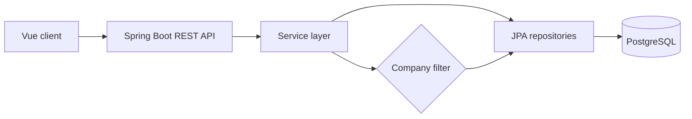

# Support Ticket System


A multi-tenant support ticket management application built with **Java Spring Boot**, **Vue.js**, and **PostgreSQL**. It is designed for companies to manage internal support requests while keeping each organisation's users, departments, and tickets securely separated.

> This project is under active development. The current README describes the core architecture and planned MVP scope; some endpoints and features may evolve.

## Overview

The system allows a company administrator to register an organisation, invite employees, and manage support tickets from a central dashboard. Employees can create and track requests, while support staff can organise tickets by status, priority, category, and department.

Each company operates as an independent tenant. Users can access only the records associated with their own company.

## Demo Account

Use the following test account to explore the application:

| Field | Value |
| --- | --- |
| Email | `northstar@gmail` |
| Password | `Northstar2026?` |

> These credentials are for demonstration purposes only and must not be reused for a production account.

## Core Features

- Company registration with an initial administrator account
- User login and invitation-based employee registration
- Multi-tenant company data isolation
- Ticket creation and management
- Ticket status, priority, and category tracking
- Optional department assignment
- Company-specific department lists
- Dashboard interface for ticket summaries and recent activity
- Responsive user interface built with Vuetify
- RESTful communication between the frontend and backend

## Multi-Tenant Design

The application uses a shared database with tenant-aware records. Each company is represented by a unique `company_id`, and company-owned queries are filtered using the authenticated user's company.

For example, ticket lookups use both the ticket ID and company ID. This prevents a user from accessing another organisation's ticket simply by changing a URL or request parameter.



## Technology Stack

### Frontend

- Vue 3
- Vite
- Vuetify
- Pinia
- Vue Router
- JavaScript

### Backend

- Java 21
- Spring Boot 4.1.0
- Spring Web
- Spring Security
- Spring Data JPA
- Hibernate
- Maven
- Lombok

### Database and Tools

- PostgreSQL 17
- pgAdmin
- Postman
- Git and GitHub
- IntelliJ IDEA

## Application Architecture

The backend follows a layered architecture:

- **Controller:** receives HTTP requests and returns API responses
- **DTO:** defines validated request and response data
- **Service:** contains business rules and tenant checks
- **Repository:** handles database access through Spring Data JPA
- **Entity:** maps Java objects to PostgreSQL tables

The frontend uses Vue views and reusable components, Pinia stores for shared state, and Vue Router for navigation.

## Main Data Model

| Entity | Purpose |
| --- | --- |
| `Company` | Represents an organisation using the system |
| `User` | Stores administrators, employees, and support users |
| `Department` | Groups users and tickets within a company |
| `Ticket` | Stores the support request and its lifecycle timestamps |
| `TicketStatus` | Defines states such as open, in progress, resolved, and closed |
| `TicketPriority` | Defines priority levels and display order |
| `TicketCategory` | Classifies the type of support request |

A ticket contains a generated ticket number, subject, description, company, creator, priority, category, optional department, status, and lifecycle timestamps.

## Ticket Creation Flow

1. The authenticated user submits a subject, description, priority, category, and optional department.
2. The backend identifies the user and their company from the authenticated session.
3. The selected priority and category are validated.
4. If a department is supplied, the backend verifies that it belongs to the same company.
5. The backend assigns the default `open` status and generates a unique ticket number.
6. The ticket is stored and returned as a `TicketResponse`.

The frontend does not decide `companyId`, `createdByUserId`, `statusId`, or the ticket number. These values are controlled by the backend.

## API Design

The API is served from `http://localhost:8080` during local development.

### Authentication and Invitations

| Method | Endpoint | Description |
| --- | --- | --- |
| `POST` | `/api/auth/register-company` | Register a company and its administrator |
| `POST` | `/api/auth/login-user` | Authenticate a user |
| `GET` | `/api/invitations/validate` | Validate an invitation token |
| `POST` | `/api/invitations/register` | Register an invited user |

### Departments

| Method | Endpoint | Description |
| --- | --- | --- |
| `GET` | `/api/departments/company/{companyId}` | Return departments for a company |

### Tickets

| Method | Endpoint | Description |
| --- | --- | --- |
| `POST` | `/api/tickets` | Create a ticket |
| `GET` | `/api/tickets` | List tickets for the current company |
| `GET` | `/api/tickets/{id}` | Return one company-owned ticket |
| `PUT` | `/api/tickets/{id}` | Update a company-owned ticket |
| `DELETE` | `/api/tickets/{id}` | Delete a ticket and return `204 No Content` |

### Example Create Ticket Request

```json
{
  "subject": "Unable to access company email",
  "description": "The email client displays an authentication error after sign-in.",
  "priorityId": 2,
  "categoryId": 1,
  "departmentId": 3
}
```

`departmentId` is optional. Tenant ownership and system-managed fields are derived by the backend.

## Project Structure

```text
support-ticket-system/
├── backend/
│   ├── src/main/java/com/ticketing/support/
│   │   ├── config/
│   │   ├── controller/
│   │   ├── dto/
│   │   ├── entity/
│   │   ├── repository/
│   │   └── service/
│   ├── src/main/resources/
│   └── pom.xml
├── frontend/
│   ├── src/
│   │   ├── components/
│   │   ├── router/
│   │   ├── stores/
│   │   └── views/
│   └── package.json
└── README.md
```

## Local Setup

### Prerequisites

Install the following tools before running the project:

- Java 21
- Node.js and npm
- PostgreSQL 17
- Git

### 1. Clone the Repository

```bash
git clone https://github.com/selenkarakaya/support-ticket-system.git
cd support-ticket-system
```

Replace the repository URL above if the final GitHub repository uses a different name.

### 2. Create the PostgreSQL Database

```sql
CREATE DATABASE support_ticket_system;
```

The current local database connection uses port `5433`. Configure the backend in `backend/src/main/resources/application.properties`:

```properties
spring.datasource.url=${DB_URL:jdbc:postgresql://localhost:5433/support_ticket_system}
spring.datasource.username=${DB_USERNAME:postgres}
spring.datasource.password=${DB_PASSWORD:your_password}

spring.jpa.hibernate.ddl-auto=update
spring.jpa.properties.hibernate.dialect=org.hibernate.dialect.PostgreSQLDialect
```

Do not commit real database credentials. Use environment variables in production.

### 3. Run the Backend

```bash
cd backend
./mvnw spring-boot:run
```

For Windows:

```powershell
cd backend
mvnw.cmd spring-boot:run
```

The backend runs at `http://localhost:8080`.

### 4. Run the Frontend

Open a second terminal:

```bash
cd frontend
npm install
npm run dev
```

The Vite development server normally runs at `http://localhost:5173`.

## Security

- Spring Security protects non-public API routes.
- Company registration, login, and invitation registration are public entry points.
- Invitation validation is publicly accessible by token.
- Tenant checks must be performed on the backend for all company-owned resources.
- Passwords are hashed using BCrypt and are never stored as plain text.
- Authentication hardening and JWT-based authorization are part of the active development work.

## Roadmap

- Complete JWT authentication and role-based authorization
- Add company administrator, staff, and support agent permissions
- Add ticket comments and activity history
- Support file attachments
- Add ticket assignment to support agents
- Implement email notifications
- Add SLA targets and overdue-ticket indicators
- Add search, filtering, and pagination
- Add dashboard analytics and reports
- Add automated backend and frontend tests
- Prepare production deployment

## Author

**Selen Karakaya**

- [Portfolio](https://selennurkarakaya.co.uk)
- [GitHub](https://github.com/selenkarakaya)

## Project Status

This project is being developed as a portfolio project to demonstrate full-stack development with Java Spring Boot, Vue.js, PostgreSQL, REST APIs, security, and multi-tenant application design.
